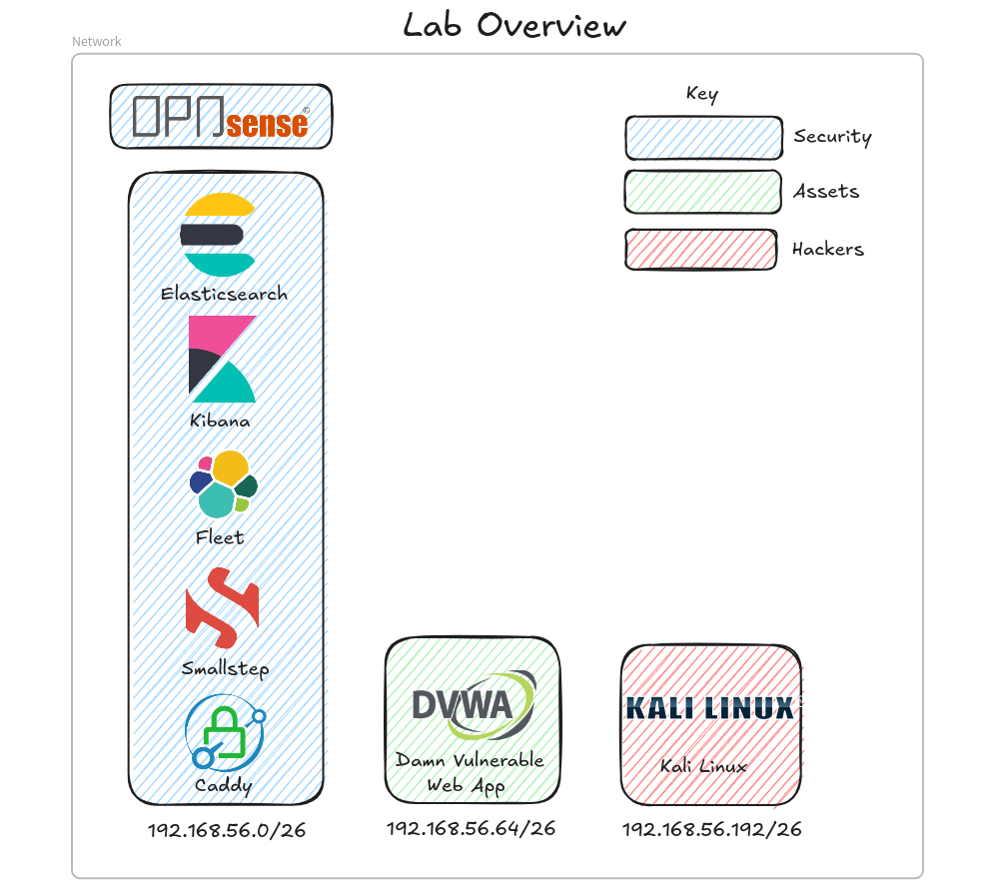

# Tartarus
Tartarus (renamed from AtomicFireFly), is designed to automate the process of deploying and testing security products. This solution consists of a single node ElasticSearch cluster on a Rocky8 Linux guest (for CentOS/RHEL cross compatibility). The Windows node features Sysmon, Elastic Agent, and Atomic Red Team. Additionally, a Kali Linux instance with Caldera pre-packaged ensures comprehensive testing and monitoring.  

## Requirements (host)
### Hardware
#### SIEM only
The default deployment `vagrant up` will deploy only the Elastic SIEM and Opnsense firewall for testing.  
| VM Name               | CPU Cores | Memory (MB) | Private IP     |
|-----------------------|-----------|-------------|----------------|
| tartarus-opnsense     | 2         | 1024        | 192.168.56.2   |
| tartarus-elastic      | 4         | 8192        | 192.168.56.10  |

##### Total
RAM: 9GB  
CPU: 6

##### Diagram

#### SIEM + Linux
Deploy with `HOSTS=linux vagrant up opnsense elastic linux` will deploy the SIEM, firewall and a Linux host.  
| VM Name               | CPU Cores | Memory (MB) | Private IP     |
|-----------------------|-----------|-------------|----------------|
| tartarus-opnsense     | 2         | 1024        | 192.168.56.2   |
| tartarus-elastic      | 4         | 8192        | 192.168.56.10  |
| tartarus-linux        | 1         | 2048        | 192.168.56.70  |

##### Total
RAM: 11GB  
CPU: 7  

##### Diagram

#### SIEM + Windows
Deploy with `HOSTS=windows vagrant up opnsense elastic windows` will deploy the SIEM, firewall and a Windows host.  
| VM Name               | CPU Cores | Memory (MB) | Private IP     |
|-----------------------|-----------|-------------|----------------|
| tartarus-opnsense     | 2         | 1024        | 192.168.56.2   |
| tartarus-elastic      | 4         | 8192        | 192.168.56.10  |
| tartarus-linux        | 1         | 4096        | 192.168.56.80  |

##### Total
RAM: 13GB  
CPU: 7  

##### Diagram

#### SIEM + Linux + Windows
Deploy with `HOSTS=linwin vagrant up opnsense elastic linux windows` will deploy the SIEM, firewall, Linux and Windows.  
| VM Name               | CPU Cores | Memory (MB) | Private IP     |
|-----------------------|-----------|-------------|----------------|
| tartarus-opnsense     | 2         | 1024        | 192.168.56.2   |
| tartarus-elastic      | 4         | 8192        | 192.168.56.10  |
| tartarus-linux        | 2         | 2048        | 192.168.56.70  |
| tartarus-linux        | 1         | 4096        | 192.168.56.80  |

##### Total
RAM: 15GB  
CPU: 9  

##### Diagram

#### SIEM + Damn Vulnerable Web Application
Deploy with `HOSTS=dvwa vagrant up opnsense elastic dvwa` will deploy the SEIM, firewall and the DVWA.
Although we expose the default port `80` that the DVWA is served on to the host machine at `http://127.0.0.1:8080` it's advised to deploy the Kali host to attack the DVWA as it will have more of the tools you'll need pre-installed.
| VM Name               | CPU Cores | Memory (MB) | Private IP     |
|-----------------------|-----------|-------------|----------------|
| tartarus-opnsense     | 2         | 1024        | 192.168.56.2   |
| tartarus-elastic      | 4         | 8192        | 192.168.56.10  |
| tartarus-dvwa         | 1         | 2048        | 192.168.56.71  |

##### Total
RAM: 11GB  
CPU: 7  

##### Diagram

### Software
[VirtualBox](https://www.virtualbox.org/wiki/Downloads)  
[Vagrant](https://developer.hashicorp.com/vagrant/downloads)  

## Nodes (guests)

| VM Name               | Operating System                     | CPU Cores | Memory (MB) | Private IP     | Components                                                        |
|-----------------------|--------------------------------------|-----------|-------------|----------------|-------------------------------------------------------------------|
| tartarus-opnsense     | bento/freebsd-13.2                   | 2         | 1024        | 192.168.56.2   | Opnsense, Suricata                                                |
| tartarus-elastic      | bento/rockylinux-8.7                 | 4         | 8192        | 192.168.56.10  | ElasticSearch, Kibana, Fleet, Smallstep CA, Caddy                 |
| tartarus-linux        | bento/rockylinux-8.7                 | 1         | 2048        | 192.168.56.70  | Elastic Agent                                                     |
| tartarus-dvwa         | bento/ubuntu                         | 1         | 2048        | 192.168.56.71  | Elastic Agent, DVWA                                               |
| tartarus-windows      | gusztavvargadr/windows-10-21h2-enterprise | 2    | 4096        | 192.168.56.80  | Elastic Agent, Sysmon, Atomic Red Team                            |
| tartarus-kali         | kalilinux/rolling                    | 2         | 4096        | 192.168.56.200 |                                                                   |

### IP Addresses 
| Reserved for         | IP Address Range |
|----------------------|------------------|
| Networking           | 1-9              |
| Security devices     | 10-19            |
| Linux hosts          | 70-79            |
| Windows hosts        | 80-89            |
| Adversaries          | 200+             |

### Full network layout
| Network Address | Usable Range                    | Broadcast Address | Usage   |
| --------------- | ------------------------------- | ----------------- | ------- |
| 192.168.56.0    | 192.168.56.1 - 192.168.56.62    | 192.168.56.63     | SIEM    |
| 192.168.56.64   | 192.168.56.65 - 192.168.56.126  | 192.168.56.127    | Assets  |
| 192.168.56.128  | 192.168.56.129 - 192.168.56.190 | 192.168.56.191    | Targets |
| 192.168.56.192  | 192.168.56.193 - 192.168.56.254 | 192.168.56.255    | Hackers |

Firewall rules (will change in future so only used as a guide)  

#### Diagram

#### Firewall Aliases
| Name        | Type    | Content                                     | Description                |
|------------|---------|----------------------------------------------|----------------------------|
| RFC1918    | Network | 192.168.0.0/16, 172.16.0.0/12, 10.0.0.0/8    | RFC1918 Private Networks   |
| WebPorts   | Port    | 80, 443                                      | Web Ports                  |
| Services   | Port    | 53, 123                                      | DNS & NTP                  |
| Monitoring | Port    | 8220, 9200                                   | Monitoring                 |
| DHCP_Ports | Port    | 67, 68                                       | DHCP Ports                 |

#### Firewall rules
| Action | Quick | Description                   | Interface(s)    | Protocol | Source  | Destination | Dest. Port(s)               |
|--------|-------|-------------------------------|-----------------|----------|---------|-------------|-----------------------------|
| Pass   |  Yes  |  Allow DNS and NTP traffic    | Assets, Hackers | UDP      | Any     | (self)      | Services (53, 123)          |
| Pass   |  Yes  |  Allow Elasticsearch traffic  | Assets, Targets | TCP      | Any     | LAN         | Monitoring (, 8220, 9200)   |
| Block  |  No   |  Block all traffic to RFC1918 | Assets, Targets | Any      | Any     | RFC1918     | Any                         |
| Pass   |  Yes  |  Allow DHCP traffic           | Targets         | UDP      | Any     | (self)      | DHCP_Ports (67, 68)         |
| Pass   |  No   |  Allow web traffic            | Assets, Hackers | TCP      | Any     | Any         | WebPorts (80, 443)          |
| Pass   |  Yes  |  Allow SSH traffic            | Hackers         | TCP      | Any     | LAN         | 22                          |
| Pass   |  Yes  |  Allow HTTPS and SSH          | WAN             | TCP      | Any     | (self)      | 22, 443                     |
| Pass   |  Yes  |  Allow All from LAN           | LAN             | ANY      | Any     | ANY         | ANY                         |

All hosts have static IP addresses assigned in the the Vagrant file. All hosts also have 2 interfaces, the first is the default NAT type that Vagrant needs to manage the VMs via SSH / winrm, the second interface is the statically assigned one. We "cost out" the first interface by some metic trickery, this doesn't disable the interface entirely so it is still possible to reach the outside, even if you enforce FW rules however for the most part the firewall rules are respected.

## Note
**This is not for production!**  
Please use as a guide / lab only, I do things like placing the elastic user password in a file  
This should never be done in prod!  
If an adversary gets you Elastic super-user password or root access to a node it is **GAME OVER!**  
To ensure everything works as expected boot the Opnsense node first then the elastic node.  

### DNS settings
We use `.home.arpa.` to conform with [RFC8375](https://www.rfc-editor.org/rfc/rfc8375.html)   
#### Local 
Replace (Vagrant host ip) with the IP of the host machine you will run Vagrant from  
Windows Powershell  
`Add-Content 'C:\Windows\System32\Drivers\etc\hosts' "127.0.0.1 tartarus-elastic.home.arpa"`  
Linux Bash  
`echo "127.0.0.1 tartarus-elastic.home.arpa" >> /etc/hosts`  
#### Remote
Used for remote deployments
Replace (Vagrant host ip) with the IP of the host machine you will run Vagrant from  
Windows Powershell  
`Add-Content 'C:\Windows\System32\Drivers\etc\hosts' "(Vagrant host ip) tartarus-elastic.home.arpa"`  
Linux Bash  
`echo "(Vagrant host ip) tartarus-elastic.home.arpa" >> /etc/hosts`  

## Opnsense  
Once Opnsnese finishes installing you can log in by going to `https://127.0.0.1:8443`. All the config is already done for you.  

## Kibana  
It is safe to ignore the HTTPS certificate warning as we generated our own self-signed certs in this instance.  
You can now add the generated CA certificate `root_ca.crt` saved in ./certs/ to your browser trust store and you will never see a "this site is insecure" again* for this project thanks to the Smallstep CA + Caddy ACME certificate setup.  
*The certs last 24 hours and sometimes (if you leave your host in hibernation for a while) the cert expires before Caddy redoes the ACME process. A simple `sudo systemctl restart caddy` on the `tartarus-elastic` node and you'll be golden.  
**Log into Kibana (local)**  
From your host machine   
`https://tartarus-elastic.home.arpa:5443`  
Must be via domain name now due to Caddy reverse proxy, just add an override in `/etc/hosts` or `C:\Windows\System32\drivers\etc\hosts` to point `tartarus-elastic.home.arpa` to `127.0.0.1`  
**Log into Kibana (remote)**  
`https://tartarus-elastic.home.arpa:5443`  
  
Username: `elastic`  
You can save the password in a file called "Password.txt" in the directory you ran Vagrant from, this is the password to the Superuser account so be careful!  
The file is in `.gitignore` however it's not good practice to save passwords to disk!  
The password is also printed to the terminal / shell you ran `vagrant up` from.  

## Viewing Kibana Alerts
Once you have logged into the Kibana instance on `https://tartarus-elastic.home.arpa:5443` now it is time to view the alerts.  
The Windows and Linux alerts are auto enabled for you.  
Search for alerts in the universal search tab, or open the burger and scroll down to the security tab.  
  
Now search for "alerts".  
  
You should see the alerts page (Note you might not have any alerts yet, you'd need to start the Windows host and run the  EDR-Telemetry-Generator for example)  

## Loading Sigma Rules
We make use of some existing Sigma rules, located in `./rules` as well I have written my own custom rules to detect Atomic Red Team activity. All rules are under DRL. 
To load the custom rules replicate the `.env.example` as a `.env` file and delete everything after the values (so everything to the right and including the `#` so it's only key=value per line).  
Have Python 3 installed.  
Install the requirements with a little `python3 -m pip install -r requirements.txt` this will install pySigma needed to load the rules.  
Run the `sigmaApiLoad.py` file with a little `python3 sigmaApiLoad.py`.  
The rules in Elastic will start with `SIGMA -` so they are easy to find.  

## Atomic Red Team Tests
Using the EDR-Telemetry-Generator from [EDR-Telemetry](https://github.com/tsale/EDR-Telemetry)  
Open PowerShell and Git clone the EDR-Telemetry project and run it, Git is pre-installed for ease of use.  
`git clone https://github.com/tsale/EDR-Telemetry.git`  
It goes without saying but this should only be run on a VM, don't run it on your host OS!  
`& .\EDR-Telemetry\Tools\Telemetry-Generator\telemetry-generator.ps1`

Now look at the Kibana alerts dashboard.  

## Inspirations
The main inspiration for this work is from the incredible project [EDR-Telemetry](https://github.com/tsale/EDR-Telemetry)  
The use of Vagrant as a provisioner was inspired by [Jeff Geerling's](https://github.com/geerlingguy) excellent book Ansible for DevOps.  

## Resources
### TryHackMe
- [Atomic Red Team](https://tryhackme.com/room/atomicredteam)  
- [Elastic](https://tryhackme.com/room/investigatingwithelk101)  
### GitHub
- [EDR-Telemetry](https://github.com/tsale/EDR-Telemetry)  
- [Caldera](https://github.com/mitre/caldera)  
- [Elastic](https://github.com/elastic)
- [Atomic Red Team](https://github.com/redcanaryco/atomic-red-team)
- [Sigma](https://github.com/SigmaHQ/sigma)
- [Caddy](https://github.com/caddyserver/caddy)
- [Smallstep](https://github.com/smallstep/certificates)

## TODO
Look into how ART works on Linux  
Add Windows 2022 Server promoted to domain controller  
Add a Shuffle SOAR node  

## Future improvements

## Licenses
**YOU ARE RESPONSIBLE FOR ENSURING YOU COMPLY WITH ALL APPLICABLE LICENSES, LOCAL AND/OR INTERNATIONAL LAW(S)!**  
All licenses are valid at the time of commit !  
- All original work in this project (except the Sigma Rules) is licensed under [The Unlicense](https://github.com/ScioShield/Tartarus/blob/master/LICENSE.md)
- Vagrant is licensed under the [Business Source License 1.1](https://github.com/hashicorp/vagrant/blob/main/LICENSE)
- VirtualBox is licensed under [The GNU General Public License (GPL) Version 3](https://www.virtualbox.org/wiki/GPLv3)
- Rocky Linux is licensed under the [BSD 3-Clause](https://rockylinux.org/legal/licensing)
- Kali Linux is licensed under the [EULA](https://www.kali.org/docs/policy/eula/EULA.txt)
- Windows is licensed under the [Windows 10 Enterprise Evaluation](https://www.microsoft.com/en-us/evalcenter/evaluate-windows-10-enterprise)
- Elastic is licensed under the [GNU Affero General Public License v3.0](https://github.com/elastic/elasticsearch/blob/main/LICENSE.txt)
- EDR-Telemetry is unlicensed
- Atomic Red Team is licensed under the [MIT LIcense](https://github.com/redcanaryco/atomic-red-team/blob/master/LICENSE.txt)
- pySigma is licensed under the [GNU Lesser General Public License v2.1](https://github.com/SigmaHQ/pySigma/blob/main/LICENSE)
- Sigma Rules are licensed under the [DRL 1.1](https://github.com/SigmaHQ/Detection-Rule-License/blob/main/LICENSE.Detection.Rules.md)
- Caddy is licensed under the [Apache License 2.0](https://github.com/caddyserver/caddy/blob/master/LICENSE)
- Smallstep is licensed under the [Apache License 2.0](https://github.com/smallstep/certificates/blob/master/LICENSE)  
- Opnsense is licensed under the [BSD 2-Clause “Simplified” license](https://docs.opnsense.org/legal.html#opnsense-license-copyright)  
- Opnsense Vagrant config file is licensed under the [BSD-2-Clause license](https://github.com/punktDe/vagrant-opnsense/blob/main/COPYRIGHT.md)
- FreeBSD is licensed under the [FreeBSD License](https://www.freebsd.org/copyright/freebsd-license/)
- Damn Vulnerable Web Application (DVWA) is licensed under the [GPL-3.0 license](https://github.com/digininja/DVWA?tab=GPL-3.0-1-ov-file)

Supporting software (like bash, wget, jq, etc) are also licensed under their respective licenses.  
Anything not directly mentioned above does, of course, retain its license!  